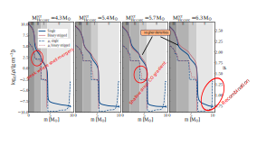

[//]: # (Title of presentation)
class: middle
background-image: linear-gradient(rgba(0, 0, 0, 0.6), rgba(0, 0, 0, 0.9)), url( images/fig13.svg )

.boxtitle3.noborder.fgtransparent.pushfront[
# .fsize120[.blue[**Different to the core: the pre-supernova structures of massive single and binary-stripped stars**]]
]

 

## .center.blue[**Laplace et al. 2021**]
### .center.or1[**arXiv**: [.bluelight[2102.05036]](https://arxiv.org/abs/2102.05036)]

[//]: # (Introduction)
---
class: middle
background-color: white

.boxtitle3.noborder.fgtransparent.pushfront[
# .fsize120[.black[**Motivation**]]
]

### .center[Massive stars belongs to binaries (Sana et al., etc.)]

### .center[Most studies do not consider binarity but rather pure He stars or remove mass through winds $\\rightarrow$ single star evolution]

### .center[Also, binary simulations are stopped early (core C depletion), using a little nuclear reaction network]

.boxtitle3.noborder.fgtransparent.pushfront[
# .fsize120[.black[**This work**]]
]

### .center[Detailed evolution of single and binaries with masses 11 - 21 M$\\_\\odot$ until core collapse, using a 128 isotope nuclear reaction network. Interacting binaries are studied at a stable case B of mass-transfer]

[//]: # (single vs binary: comparison)
---
class: middle
background-color: white

.boxtitle3[
# **Comparison: single vs binary**
]

.center[

]

[//]: # (single vs binary: differences)
---
class: middle
background-color: white

.boxtitle3[
# **Differences: single vs binary**
]

#### .center[Comparison between **similar** core mass progenitors $\\rightarrow$ would produce **similar** compact objects]

.center[

]

[//]: # (single vs binary: differences)
---
class: middle
background-color: white

.boxtitle3[
# **Differences: single vs binary. Density profiles**
]

.center[

]

[//]: # (single vs binary: differences)
---
class: middle
background-color: white

.boxtitle3[
# **Differences: single vs binary. Density profiles**
]

.center[

]

[//]: # (single vs binary: differences)
---
class: middle
background-color: white

.boxtitle3[
# **Differences: single vs binary. Density profiles**
]

.center[

]

[//]: # (single vs binary: differences)
---
class: middle
background-color: white

.boxtitle3[
# **Differences: single vs binary. Density profiles**
]

.center[

]

[//]: # (summary)
---
class: middle
background-color: white

.boxtitle5[.center[
# **Summary**
]
]

### - Differences in the compactness of stars (same initial mass) in single and binary models $\\rightarrow$ binaries might explore more easily
 
### - Composition is different in single and binary models $\\rightarrow$ different nucleosynthesis in the supernova stage which can be observed
 
### - Wind-mass loss, responsible for the C/O gradient outside the He-depleted core of binaries, is highly uncertain and can, in principle, affect both the core composition at late stages and the density structure pre-supernova
 
### - Convection and shell mergers still debated. Changes abundances in the star, so nucleosynthesis at supernova is affected by it
