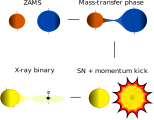
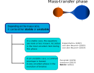
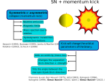
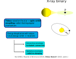
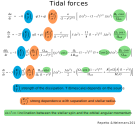
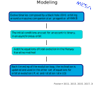
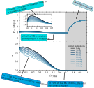
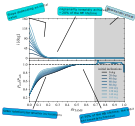
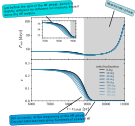
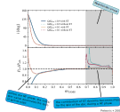

[//]: # (Title of presentation)
class: middle
background-image: linear-gradient(rgba(0, 0, 0, 0.6), rgba(0, 0, 0, 0.75)), url( images/magnetar.jpg )

.boxtitle3.noborder.fgtransparent.pushfront[
# .fsize120[.blue[**Impact of tides on non-coplanar orbits of progenitors of high-mass X-ray binaries**]]
]

 
 

### .center.bluelight[**Reunión Anual de la Asociación Argentina de Astronomía**]
### .center.bluelight[2022-09-22]

 

### .center.blue[**A. Simaz Bunzel**, F. Garcia, J. A. Combi, F. Fortin & S. Chaty]

 

### .center.white[Instituto Argentino de Radioastronomía (CONICET; CICPBA; UNLP)]
### .center.white[Université Paris Cité, CNRS, Astroparticule et Cosmologie]

[//]: # (Introduction)
---
class: middle
background-image: linear-gradient(rgba(0, 0, 0, 0.2), rgba(0, 0, 0, 0.2)), url( images/interacting_binary.svg )

---
class: middle
background-image: linear-gradient(rgba(0, 0, 0, 0.9), rgba(0, 0, 0, 0.9)), url( images/interacting_binary.svg )

.boxtitle3.noborder.fgtransparent.pushfront[
# .fsize120[.blue[**How do X-ray binaries form?**]]
]

---
class: center nopadding middle split-30

.column_bt2[
.pushfront.vmiddle[
## .blue[Formation channel]

]]

.column_t2.pushfront[.vmiddle.nopadding[
.boxtitle3.noborder[
.center[.figplaint-maxh700.noborder[]]

]]
]

---
class: center nopadding middle split-30

.column_bt2[
.pushfront.vmiddle[
## .blue[Formation channel]

### .gray[Uncertainties]
]]

.column_t2.pushfront[.vmiddle.nopadding[
.boxtitle3.noborder[
.center[.figplaint-maxh700.noborder[]]

]]
]

---
class: center nopadding middle split-30

.column_bt2[
.pushfront.vmiddle[
## .blue[Formation channel]

### .gray[Uncertainties]
]]

.column_t2.pushfront[.vmiddle.nopadding[
.boxtitle3.noborder[
.center[.figplaint-maxh700.noborder[]]

]]
]

---
class: center nopadding middle split-30

.column_bt2[
.pushfront.vmiddle[
## .blue[Formation channel]

### .gray[Uncertainties]
]]

.column_t2.pushfront[.vmiddle.nopadding[
.boxtitle3.noborder[
.center[.figplaint-maxh700.noborder[]]

]]
]

---
class: center nopadding middle split-30

.column_bt2[
.pushfront.vmiddle[
## .blue[Formation channel]

### .gray[Uncertainties]
]]

.column_t2.pushfront[.vmiddle.nopadding[
.boxtitle3.noborder[
.center[.figplaint-maxh700.noborder[]]

]]
]

---
class: center, middle
background-image: linear-gradient(rgba(0, 0, 0, 0.6), rgba(0, 0, 0, 0.85)), url( images/magnetar.jpg )

[//]: # (.abs-layout.p-m.top-31.left-0.width-100.oc-bg-white.center.white[)
# .blue[Tides on non-coplanar binaries]

 

 

## .bluelight[Study how tides change orbital parameters of a high-mass X-ray binary (HMXB) after an asymmetric momentum kick]

 

[//]: # (Methods. Overview)
---
class: center nopadding middle split-30

.column_bt2[
.pushfront.vmiddle[
## .blue[Methods]

### .gray[Stellar evolution]
]]

.column_t2.pushfront[.vmiddle.nopadding[
.boxtitle3.noborder[
.center[.figplaint-maxh700.noborder[]]

]]
]

---
class: center nopadding middle split-30

.column_bt2[
.pushfront.vmiddle[
## .blue[Results]

### .gray[I. Mass-transfer during core Hydrogen burning]
### .gray[(Case A)]
]]

.column_t2.pushfront[.vmiddle.nopadding[
.boxtitle3.noborder[
.center[.figplaint-maxh700.noborder[]]

]]
]

---
class: center nopadding middle split-30

.column_bt2[
.pushfront.vmiddle[
## .blue[Results]

### .gray[I. Mass-transfer during core Hydrogen burning]
### .gray[(Case A)]
]]

.column_t2.pushfront[.vmiddle.nopadding[
.boxtitle3.noborder[
.center[.figplaint-maxh700.noborder[]]

]]
]

---
class: center nopadding middle split-30

.column_bt2[
.pushfront.vmiddle[
## .blue[Results]

### .gray[I. Mass-transfer after core Hydrogen depletion]
### .gray[(Case B)]
]]

.column_t2.pushfront[.vmiddle.nopadding[
.boxtitle3.noborder[
.center[.figplaint-maxh700.noborder[]]

]]
]

---
class: center nopadding middle split-30

.column_bt2[
.pushfront.vmiddle[
## .blue[Results]

### .gray[II. Spruit-Tayler (ST) dynamo contributions]
### .gray[(Case A)]
]]

.column_t2.pushfront[.vmiddle.nopadding[
.boxtitle3.noborder[
.center[.figplaint-maxh700.noborder[]]

]

]
]

---
class: middle
background-image: linear-gradient(rgba(0, 0, 0, 0.9), rgba(0, 0, 0, 0.9)), url( images/interacting_binary.svg )

.boxtitle3.noborder.fgtransparent.pushfront[
# .fsize120[.blue[**Conclusions**]]
]

---
class: middle
background-image: linear-gradient(rgba(0, 0, 0, 0.9), rgba(0, 0, 0, 0.9)), url( images/interacting_binary.svg )

.boxtitle3.noborder.card.blue.middle[

### .black[After an asymmetric kick, tides will operate to evolve the binary towards an equilibrium configuration]

]

 

.boxtitle3.noborder.card.gradient.white.middle[

### .bluelight[The closer the components of the binary are, the faster this configuration will be reached. In some cases, it is achieved just after a few hundreds of years of mass-transfer]

]

 

.boxtitle3.noborder.card.blue.middle[

### .black[The initial spin, as well as the Spruit-Tayler dynamo, regulates the timescales for each of the equilibrium conditions]

]
