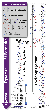

[//]: # (Title of presentation)
class: split-40 nopadding
background-color: black
background-image: url( bkgs/bitmap.png )

.column_t2[
]

.column_t2.shadelightdark.add-left-border.pushfront[.vmiddle.nopadding[
.boxtitle3.noborder[
 
 
# .fsize120[.blue[**Progenitors of low-mass binary black hole mergers**]]

 
 
### Adolfo Simaz Bunzel, Federico García,

### Sylvain Chaty, Edward Porter & Eric Chassande-Mottin
 
##### Instituto Argentino de Radioastronomía (IAR), Berazategui, Argentina
##### Facultad de Ciencias Astronómicas y Geofísicas (FCAGLP), La Plata, Argentina
##### AIM - APC, Université Paris Diderot, France
]
]]

[//]: # (Outline of talk)
[//]: # (---)
[//]: # (class: column_t1 middle)
[//]: # (background-color: light-blue)

[//]: # (.fonth4[)
[//]: # (.tabtype2.fullwidth[)
[//]: # (| Outline   |)
[//]: # (|:----------:|)
[//]: # (|.black[A new window of observation: dawn of ___gravitational waves___]|)
[//]: # (|.black[Sources of LVC ___gravitational waves___ : progenitors]|)
[//]: # (|.black[Example on some of these progenitors]|)
[//]: # (])
[//]: # (])

[//]: # (Introduction)
---
class: middle
background-image: url( bkgs/interacting_binary.jpg )

---
class: middle
background-image: linear-gradient(rgba(0, 0, 0, 0.9), rgba(0, 0, 0, 0.9)), url( bkgs/interacting_binary.jpg )

.boxtitle3.noborder.fgtransparent.pushfront[
# .fsize120[.blue[**How common are they?**]]
]

---
class: split-50 nopadding
background-image: linear-gradient(rgba(0, 0, 0, 0.9), rgba(0, 0, 0, 0.5)), url( bkgs/interacting_binary.jpg )

.column_t2.pushfront[.vmiddle.nopadding[
.boxtitle3.noborder[

 

.center[.figplaint-95.noborder[]
]

 

.blue[Fractions estimated for all stars with initial masses

above 15 M$\_\odot$ (from Sana et al., 2012)
]

]
]]

.column_t2.pushfront[.vmiddle.nopadding[
.boxtitle3.noborder[

 

.center[.figplaint-95.noborder[]]

 

.blue[Larger sample of binary systems 

(adapted from Moe & di Stefano, 2017)
]

]
]]

[//]: # (Different progenitors of GWs)
---
class: middle
background-color: black
background-size: contain
background-image: url( bkgs/gwtc.png )

---
class: middle
background-color: black
background-size: contain
background-image: linear-gradient(rgba(0, 0, 0, 0.9), rgba(0, 0, 0, 0.9)), url( bkgs/gwtc.png )

.boxtitle3.noborder.fgtransparent.pushfront[
# .fsize120[.blue[**What about this?**]]

 

# .fsize120[.blue[**How do they form?**]]
]

---
class: center nopadding middle split-30

.column_t1[
.vmiddle[
### .or1[Dynamical interaction channel]
.white[
]
 
.white[Key aspect: **dense stellar cluster** such that there are several interactions before binary black hole formation]
]]

.column_t2[
.vmiddle[

.center[.figplaint-maxh550.noborder[]]

###### .black[image from Rodriguez et al. 2016]

]

]

---
class: center nopadding middle split-30

.column_t1[
.vmiddle[
### .or1[Isolated evolutionary channel (I)]
.white[
]
 
.white[Key aspect: stars need to evolve **chemical homogeneously** their entire life]
]]

.column_t2[
.vmiddle[

.center[.figplaint-maxh450.noborder[]]

###### .black[image from Marchant et al. 2016]

]

]

---
class: center nopadding middle split-30

.column_t1[
.vmiddle[
### .or1[Isolated evolutionary channel (II)]
.white[
]
 
.white[Key aspect: need a **common-envelope phase** (CE)]
]]

.column_t2[
.vmiddle[

.center[.figplaint-maxh550.noborder[]]

###### .black[image from García et al., in prep.]

]

]

[//]: # (Some properties of GW151226 & GW170608)
---
class: center middle
background-color: black
background-image: linear-gradient(rgba(0, 0, 0, 0.9), rgba(0, 0, 0, 0.9)), url( bkgs/stellar-graveyard-LVC.png )

.boxtitle3.noborder.fgtransparent.pushfront[
# .fsize120[.blue[**Low-mass binary black hole mergers**]]
]

---
class: center
background-color: black
background-image: url( bkgs/low_mass_bbhs_in_stellar_graveyard.png )

[//]: # (Parameters of BHs)
---
class: split-50 nopadding

.column_t1[

.center[
.shadelightdark.top_abs[.pushfront[## GW151226]
]]

.vmiddle[

##### - Discovery date: December 26, 2015

##### - Hanford SNR of 10.5, Livingston SNR of 7.9

##### - $M\_{\mathrm{BH},1} = 14.2^{+8.3}\_{-3.7}$ $M\_{\odot}$; $M\_{\mathrm{BH},2} = 7.5^{+2.3}\_{-2.3}$ $M\_{\odot}$

##### - $M\_{\mathrm{chirp}} = 8.9^{+0.3}\_{-0.3}$ $M\_{\odot}$; $M\_{\mathrm{merged-BH}} = 20.8^{+6.1}\_{-1.7}$ $M\_{\odot}$

##### - __redshift__: $z = 0.09^{+0.03}\_{-0.04}$

.center[.figplaint-60.noborder[]]

]
]

.column_t2[

.center[
.shadelightdark.top_abs[.pushfront[## GW170608]
]]

.vmiddle[

##### - Discovery date: June 8, 2017

##### - Hanford SNR of 10.5, Livingston SNR of 7.9

##### - $M\_{\mathrm{BH},1} = 12^{+7}\_{-2}$ $M\_{\odot}$; $M\_{\mathrm{BH},2} = 7^{+2}\_{-2}$ $M\_{\odot}$

##### - $M\_{\mathrm{chirp}} = 7.9^{+0.2}\_{-0.2}$ $M\_{\odot}$; $M\_{\mathrm{merged-BH}} = 18^{+4.8}\_{-0.9}$ $M\_{\odot}$

##### - __redshift__: $z = 0.07^{+0.03}\_{-0.03}$

.center[.figplaint-60.noborder[]]

]
]

[//]: # (Aim of work & Methodology)
---
class: center no padding middle split-30

.column_t1[
.vmiddle[
## Aims

]]

.column_t2[
.vmiddle[

#### <u>First part</u>: study the progenitor properties for these two GW events in the isolated binary evolutionary scenario

.figplaint-90.noborder[]

<ul>
 
For that, we follow the complete evolution of the binary:
from two non-degenerate stars up to the formation of the two
black holes.

We used a detailed evolutionary code, publicly available,
<b>MESA</b>, which we modified to include the common-envelope
phase and a compact object formation
</ul>

#### <u>Second part</u>: obtain merger rates for them in O1, O2 and expected ones in O3
]
]

---
class: center nopadding middle split-30

.column_t1[
.vmiddle[
## Methods:

### .or1[First part]
]]

.column_t2[
.vmiddle[.tabtype2[
| Free parameters in simulations |
|:----------:|
|.black[Metallicity of the population, ($Z$)]|
|.black[Accretion efficiency during the stable mass-transfer phase, ($f\_{\mathrm{MT}}$)]|
|.black[Efficiency for the removal of a star envelope during and unstable mass-transfer phase, i.e, common-envelope (CE) phase, ($\alpha\_{\mathrm{CE}}$)]|
]

 

### .fsize75[.red[3D grids of initial masses and binary separations were created for each of the above parameters, giving a total number of simulations of more than 50 000]]
]]

[//]: # (Population results)
---
class: center nopadding middle split-50

.column_t2[
 
.figplaint-75.noborder[]
]

.column_t1[
 
### Initial binary parameters

### $\alpha\_{\mathrm{CE}}$ = 2

   

* Higher metallicities requires increasingly massive stars: directly
related to winds

* In the low mass-accretion regime, only low metallicity binaries
are progenitors. High metallicity ones produce low chirp masses

* For $\epsilon$ > 0.2, binaries with similar initial masses are
also progenitors
]

---
class: center nopadding middle split-50

.column_t2[
 
.figplaint-75.noborder[]
]

.column_t1[
 
### Map with BBH properties

### $\alpha\_{\mathrm{CE}}$ = 2

.figplaint-maxh350.noborder[]

]

---
class: center nopadding middle split-50

.column_t2[
 
.figplaint-75.noborder[]
]

.column_t1[
 
### Map with BBH properties

### $\alpha\_{\mathrm{CE}}$ = 2

.figplaint-maxh350.noborder[]

]

---
class: center nopadding middle split-50

.column_t2[
     

.figplaint-75.noborder[]
]

.column_t1[
 
### Initial binary parameters

### $\alpha\_{\mathrm{CE}}$ = 1

  

* Initial mass ratios of progenitors are closer to unity (similar initial
masses)

* No solutions were found for mass-accretion efficiencies that are below 0.2

* Binaries with separations lower than 60 R$\_\odot$ merge during the CE
phase as a consequence of having a lower efficiency for the CE ejection

* Merger times are also lowered wrt the ones from high CE ejection efficiencies

]

---
class: center nopadding middle split-50

.column_t2[
     

.figplaint-75.noborder[]
]

.column_t1[
 
### Map with BBH properties

### $\alpha\_{\mathrm{CE}}$ = 1

 

.figplaint-maxh350.noborder[]

]

---
class: center nopadding middle split-50

.column_t2[
     

.figplaint-75.noborder[]
]

.column_t1[
 
### Map with BBH properties

### $\alpha\_{\mathrm{CE}}$ = 1

 

.figplaint-maxh350.noborder[]
]

---
class: center nopadding middle split-30

.column_bt2[
.pushfront.vmiddle[
## .white[Methods:]

### .or1[Second part]
]]

.column_bt[
.pushfront.vmiddle[

#### .fsize75[.white[To estimate expected properties, detailed stellar models were rescaled by empirical __initial mass functions__ (IMF, e.g., Kroupa et al., 1993) for the primary and secondary stars (flat distribution in mass-ratio) and by an __initial separation distribution__ from the observed binary orbital period distribution (Sana et al., 2012)]]

]]

---
class: center nopadding middle split-30

.column_bt2[
.pushfront.vmiddle[
## .white[Methods:]

### .or1[Second part]
]]

.column_bt[
.pushfront.vmiddle[

.left[
#### .fsize75[.white[For a number density of binaries in the multidimensional space of initial masses, separations and delay times,]]
]

.fig60.noborder[]

.left[
#### .fsize75[.white[And assuming a cosmology that relates redshift to cosmic time, and a given metallicity-dependent star formation rate,]]
]

.fig60.noborder[]

 
 

.left[
#### .fsize75[.white[The intrinsic merger rate for a GW event is:]]
]

.figplaint-90.noborder[]

]]

---
class: center nopadding middle split-50

.column_bt[
.pushfront.vmiddle[
.figplaint-75.noborder[]
]
]

.column_bt2[
.pushfront.vmiddle[

### .fsize75[.white[Merger rate density history]]

* The expected local merger rate densities are all larger for the highest
value of CE removal efficiency. Something that is related to the 'size' of
the parameter space

* For high metallicities, rates decay with redshift because of the chemical
evolution

* For the low CE efficiency, rates are largely dominated by low metallicities

]
]

---
class: center nopadding middle split-50

.column_bt[
.pushfront.vmiddle[
.figplaint-90.noborder[]
.figplaint-90.noborder[]
]
]

.column_bt2[
.pushfront.vmiddle[

### .fsize75[.white[Detectable merger rate at zero redshift]]

* The highest rate is obtained for a mass-accretion efficiency of 0.4 for
both CE efficiencies

* However, expected rates obtained are within a factor of 2, thus we are not
able to distinguish a preferred value for the mass-accretion efficiency

]
]

[//]: # (Conclusion)
---
class: center middle
background-color: black
background-image: linear-gradient(rgba(0, 0, 0, 0.9), rgba(0, 0, 0, 0.9))

.boxtitle3.noborder.fgtransparent.pushfront[
# .fsize120[.blue[**Conclusions**]]
]

---
class: center middle
background-color: black

## - .fsize75[.white[With current and future campaings of observing GW, more we will now about their progenitors]]

---
class: center middle
background-color: black

## - .fsize75[.white[With current and future campaings of observing GW, more we will now about their progenitors]]

## - .fsize75[.blue[Giving the rising power of computers, having a large grid of detailed binary calculations is possible. Even to calculate complete populations of progenitors]]

---
class: center middle
background-color: black

## - .fsize75[.white[With current and future campaings of observing GW, more we will now about their progenitors]]

## - .fsize75[.blue[Giving the rising power of computers, having a large grid of detailed binary calculations is possible. Even to calculate complete populations of progenitors]]

## - .fsize75[.white[Several uncertainties are still present in nowadays calculations, so estimates like rates can vary by order of magnitude when changing input physical parameters]]

[//]: # (Last slide)
---
class: center middle nopadding
background-color: black

.boxtitle3.noborder[
### 
# .fsize105.blue[THANK YOU!]
]

[//]: # (Backup slides)
---
class: center middle
count: false
background-color: black

.boxtitle3.noborder.fgtransparent.pushfront[
# .fsize120[.blue[**Backup**]]
]

---
class: center middle nopadding
count: false
background-color: black

.pushfront[

## .fsize80[.white[Different prescriptions for BH masses]]

.figplaint-maxh550.noborder[]
]

---
class: center middle nopadding
count: false
background-color: black

.pushfront[

## .fsize80[.white[Importance of CE phase]]

.figplaint-maxh550.noborder[]
]

---
class: center middle nopadding
count: false
background-color: black

.pushfront[

## .fsize80[.white[Importance of evolution through cosmic time]]

.figplaint-maxh550.noborder[]
]
